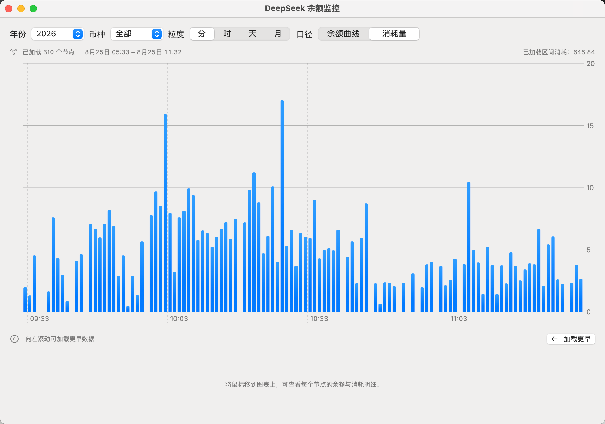

<p align="center">
  <a href="README.md">中文</a> · English
</p>

<p align="center">
  
</p>

<p align="center">
  
</p>

<h1 align="center">DS Balance Monitor</h1>
<p align="center">DeepSeek balance monitoring · macOS menu bar app</p>

<p align="center">
  <a href="https://github.com/mo2g/ds-balance-monitoring/releases"></a>
  <a href="#"></a>
  <a href="https://github.com/mo2g/ds-balance-monitoring/actions/workflows/ci.yml"></a>
  <a href="LICENSE"></a>
</p>

**DS Balance Monitor** is a native SwiftUI app that lives in your macOS menu bar.
It polls the [DeepSeek balance API](https://api-docs.deepseek.com/api/get-user-balance)
every 60 seconds, records per-minute consumption, and visualizes where your
balance goes with month / day / hour / minute charts.

> 中文文档：[README.md](README.md)

---

## ✨ Features

- **Balance monitoring**: polls every 60 seconds with exponential backoff on failure (1→2→4→5 min), live menu bar readout and a ⚠️ marker on errors
- **Four chart granularities**: month / day / hour / minute with year, currency (CNY/USD/All) and metric (balance / consumption) switchers
- **Newest-first paged loading**: minute/hour views open on the latest page and load earlier pages on demand while you scroll left; day defaults to the latest 30 days; browsing history is never interrupted and one click returns to latest
- **Point details**: hover any node to see start/end balance, consumption and recharge badge (fixed-height detail panel, no layout jumping)
- **Chinese & English UI**: switch between 中文 / English or follow the system language
- **Low-balance notifications**: default threshold ¥5, auto re-arms after a top-up
- **Menu bar styles**: icon + value / icon only / value only, with a preferred currency
- **Extras**: launch at login, immediate re-poll on system wake, per-year SQLite tables

## 📦 Quick Start

### Option 1: Download a Release (recommended)

1. Download `DSBalanceMonitor-*-macOS.zip` from [Releases](https://github.com/mo2g/ds-balance-monitoring/releases);
2. Unzip and drag `DSBalanceMonitor.app` into Applications;
3. The app is ad-hoc signed (not notarized), so remove the quarantine flag first:

```bash
xattr -dr com.apple.quarantine /Applications/DSBalanceMonitor.app
```

4. Launch it — the "¥ balance" icon appears in the menu bar;
5. Click the icon → **Settings** → paste your DeepSeek API key (`sk-...`) → Save.

### Option 2: Build from source

Requirements: macOS 14.0+, [Xcode 15.4+](https://developer.apple.com/xcode/),
[XcodeGen](https://github.com/yonaskolb/XcodeGen).

```bash
brew install xcodegen
git clone https://github.com/mo2g/ds-balance-monitoring.git
cd ds-balance-monitoring

./scripts/run.sh      # kill old instance → clean rebuild → launch
```

Or step by step:

```bash
./scripts/build.sh
open -n build/DSBalanceMonitor.app   # -n is required: `open` alone only focuses a running instance
```

## 🖥 Usage

1. Click the menu bar icon → **Settings** → paste your API key → Save (refreshes immediately);
2. The balance shows in the menu bar; click the icon for the mini panel;
3. Choose **Open Full Window** to browse charts: switch year / currency / granularity / metric and hover for point details;
4. In minute/hour views, drag left to load earlier data and use **Back to Latest** to jump forward;
5. Switch the UI language to **中文 / English / Follow System** in Settings.

## 🔒 Data & Privacy

| Data | Location | Notes |
|---|---|---|
| Balance snapshots | `~/Library/Application Support/DSBalanceMonitor/balances.sqlite` | Per-year tables `balance_samples_2025`, `balance_samples_2026`… |
| API Key | Local UserDefaults (`dsbalance.secret.deepseek_api_key`) | **Stored in plaintext**, local only; nothing is uploaded except requests to `api.deepseek.com` |

> Why plaintext: an ad-hoc signed app gets a new CDHash on every rebuild, which
> invalidates Keychain ACLs and makes the stored key unreadable. We will move
> back to Keychain once the app ships with a stable signature/notarization.
> On a shared Mac, don't save the key — clear it in Settings when done.

## ❓ FAQ

<details>
<summary>The icon is missing from the menu bar?</summary>

Check whether menu bar managers like Bartender 4 moved it into a hidden area;
pin "DS Balance Monitor" to the visible area. Quit via the panel's Quit button or ⌘Q.
</details>

<details>
<summary>"App is damaged and can't be opened"?</summary>

The app is ad-hoc signed and not notarized, so Gatekeeper blocks it. Run:

```bash
xattr -dr com.apple.quarantine /Applications/DSBalanceMonitor.app
```

or click "Open Anyway" in System Settings → Privacy & Security.
</details>

<details>
<summary>The menu bar keeps showing ⚠️?</summary>

Usually a missing/invalid API key (401) or a network problem. Re-save the key in
Settings to retry immediately.
</details>

<details>
<summary>Does it work on Intel Macs?</summary>

Yes. Releases are universal (arm64 + x86_64); the local `build.sh` only builds
your current architecture for speed.
</details>

## 🏗 Architecture

```
MenuBarExtra (menu bar: icon + balance)
  ├─ MiniDashboardView   mini panel / open full window / settings / quit
  ├─ MainChartView       main window: month/day/hour/minute charts + paging state
  └─ SettingsView        API key / threshold / menu bar style / language / login / notifications

Core
  PollingScheduler      poll every 60s; re-poll on wake; failure backoff
  BalanceAPIClient      GET https://api.deepseek.com/user/balance
  BalanceRepository     GRDB/SQLite per-year tables + aggregation (half-open paging ranges)
  ChartPaging           pure paging windows (newest-first, boundary alignment, load threshold)
  Localization          Chinese/English dictionaries + language preference
  AlertEngine           low-balance notifications with top-up re-arm
  SettingsStore         UserDefaults settings
```

Directory layout:

```
App/       SwiftUI views (menu bar, panel, main window, settings, charts)
Core/      business logic (API client, repository, paging, localization, scheduler, alerts, secrets)
Models/    data models
Tests/     XCTest tests (72)
scripts/   build / test / release scripts
docs/      docs and screenshots
```

## 🧪 Development

```bash
./scripts/test.sh       # run all tests (72 XCTest cases)
xcodegen generate       # regenerate the Xcode project from project.yml
./scripts/release.sh    # build a universal binary zip (local release dry-run)
```

CI runs the tests on every push and PR; pushing a `v*` tag triggers the Release
workflow, which builds and uploads a universal binary zip as a draft release.

## 🚧 Known Limitations (v1)

- Single account only; no data export; fixed 60-second polling interval
- macOS 14.0+ only
- API key stored in plaintext in local preferences (see Data & Privacy)

## 📄 License

[MIT](LICENSE) © 2026 mo2g

The app icon is DeepSeek's official favicon ([cdn.deepseek.com/platform/favicon.png](https://cdn.deepseek.com/platform/favicon.png)); all rights reserved by DeepSeek.
